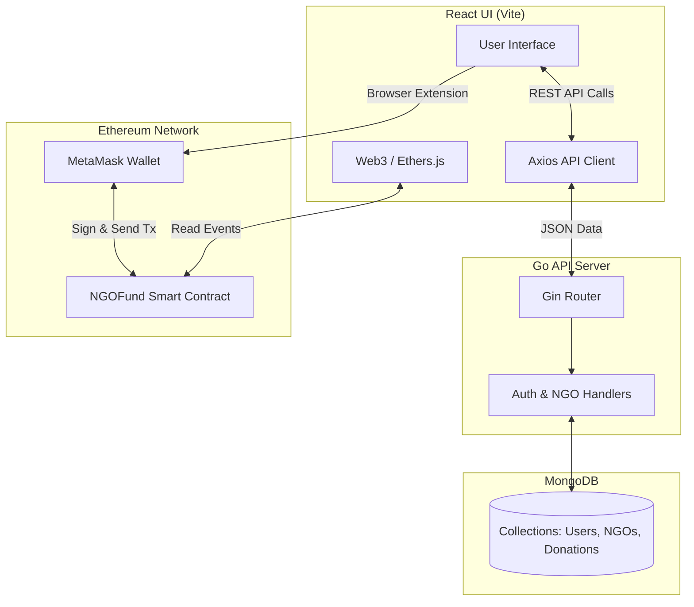
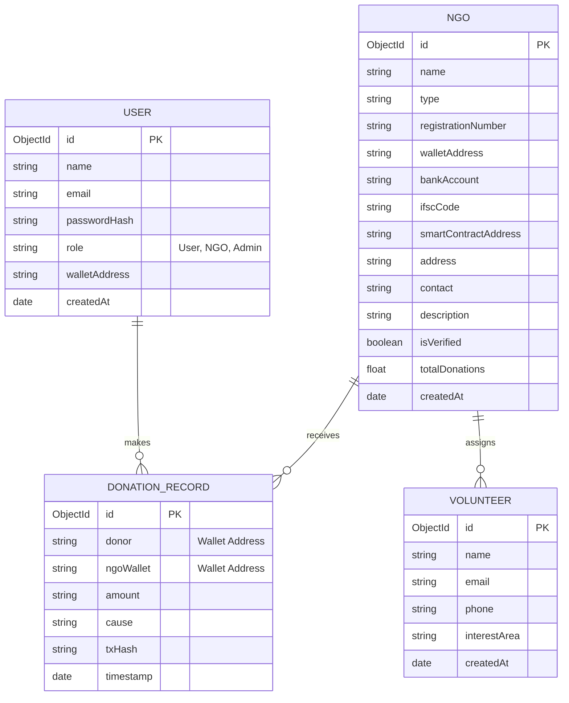

# 🌍 NGOChain

**NGOChain** is a complete, decentralized Non-Governmental Organization (NGO) management and donation platform. It leverages blockchain technology to ensure 100% transparent, immutable audit trails for cryptocurrency donations while maintaining a high-performance off-chain MongoDB database for rich analytics, user management, and seamless UI experiences.

---

## ✨ Key Features

- **On-Chain Transparency**: Every donation is recorded on an EVM-compatible blockchain (Hardhat/Sepolia) via our Solidity smart contract.
- **Dual-Write Architecture**: Fast off-chain querying (MongoDB + Go API) synchronized with immutable on-chain truth.
- **Role-Based Access Control**: JWT-secured endpoints separating permissions for Standard Users, verified NGOs, and Administrators.
- **NGO Dashboard**: A dedicated secure interface for NGOs to track total received donations and execute ETH withdrawals.
- **Admin Verification Panel**: Secure admin dashboard for reviewing and officially whitelisting NGOs on the blockchain.
- **Modern Web3 UI**: Beautiful React frontend built with Vite and TailwindCSS, fully integrated with MetaMask via Ethers.js v6.

---

## 🏗️ Technology Stack

| Layer               | Technology                  | Purpose                                                           |
| ------------------- | --------------------------- | ----------------------------------------------------------------- |
| **Frontend**        | React 19, Vite, TailwindCSS | High-performance, responsive UI with modern web design.           |
| **Web3 Client**     | Ethers.js v6                | Bridges the React frontend with the MetaMask provider.            |
| **Smart Contracts** | Solidity, Hardhat           | Handles immutable donation ledgers and fund locking/withdrawals.  |
| **Backend API**     | Go 1.25 (Gin Framework)     | Extremely fast RESTful API for auth, data sync, and aggregations. |
| **Database**        | MongoDB                     | Stores user profiles, rich NGO metadata, and volunteer rosters.   |

---

## 📂 Repository Structure

```text
NGOChain/
├── contracts/               # Hardhat Smart Contract Environment
│   ├── contracts/
│   │   └── NGOFund.sol      # Core Solidity Smart Contract
│   ├── scripts/
│   │   └── deploy.js        # Deployment script for local/testnet
│   └── hardhat.config.js    # Hardhat configuration (Networks, Compilers)
│
├── go-backend/              # High-Performance Go REST API
│   ├── database/            # MongoDB connection setup
│   ├── handlers/            # Request handlers (Controllers)
│   │   ├── analytics.go     # Dashboard metrics & aggregation
│   │   ├── auth.go          # JWT Login & Registration
│   │   ├── donations.go     # Off-chain donation sync
│   │   ├── ngo.go           # NGO profiles and whitelisting
│   │   └── volunteers.go    # Volunteer management
│   ├── models/              # BSON/JSON Data schemas (User, NGO, etc.)
│   ├── routes/              # Gin router definitions
│   └── main.go              # Entry point for the Go server
│
├── frontend/                # React 19 + Vite Frontend App
│   ├── src/
│   │   ├── components/      # Reusable UI components
│   │   │   └── Navbar.jsx   # Top navigation & Wallet connect button
│   │   ├── pages/           # Application views
│   │   │   ├── Admin.jsx    # Admin dashboard for whitelisting NGOs
│   │   │   ├── Dashboard.jsx# NGO dashboard for tracking funds
│   │   │   ├── Donate.jsx   # Donation interface for users
│   │   │   ├── Home.jsx     # Landing page
│   │   │   ├── Login.jsx    # User authentication
│   │   │   └── ...          # Other views (NGOList, Transactions, etc.)
│   │   ├── utils/           # Web3 & API helpers
│   │   ├── App.jsx          # Main React router
│   │   └── main.jsx         # React DOM entry point
│   ├── package.json         # Frontend dependencies
│   ├── tailwind.config.js   # Tailwind CSS styling configuration
│   └── vite.config.js       # Vite bundler settings
│
└── README.md                # Project documentation
```

---

## 🏗️ System Architecture



---

## 🗄️ Entity-Relationship Diagram (ERD)



---

## 📸 Application Previews

### Platform Dashboard (Dark Mode)


### NGO Listing & Donation (Light Mode)


---

## 🚀 Quick Start Guide

### Prerequisites

- [Node.js](https://nodejs.org/) (v18+)
- [Go](https://golang.org/) (v1.20+)
- [MongoDB](https://www.mongodb.com/) (Running locally on `27017` or Atlas)
- [MetaMask Extension](https://metamask.io/) installed in your browser

### 1. Smart Contract Deployment

Open a terminal and start the local EVM node:

```bash
cd contracts
npm install
npx hardhat node
```

In a **second terminal**, deploy the contract:

```bash
cd contracts
npx hardhat run scripts/deploy.js --network localhost
```

> _Note: The deployment script will automatically save the generated contract address into `frontend/src/utils/contractAddress.js`._

### 2. Backend API Setup

In a **third terminal**, start the Go server:

```bash
cd go-backend
go mod tidy
go run main.go
```

> _The API will run on `http://localhost:8080`. Make sure MongoDB is running locally._

### 3. Frontend App Setup

In a **fourth terminal**, start the React UI:

```bash
cd frontend
npm install
npm run dev
```

> _The frontend will run on `http://localhost:5173`. Ensure MetaMask is configured to use the Hardhat local network (`http://127.0.0.1:8545` with Chain ID `31337`)._

---

## 🔐 Environment Variables

Create a `.env` file in the `go-backend/` directory:

```env
PORT=8080
MONGO_URI=mongodb://localhost:27017
JWT_SECRET=your_super_secret_signing_key_here
```

---
